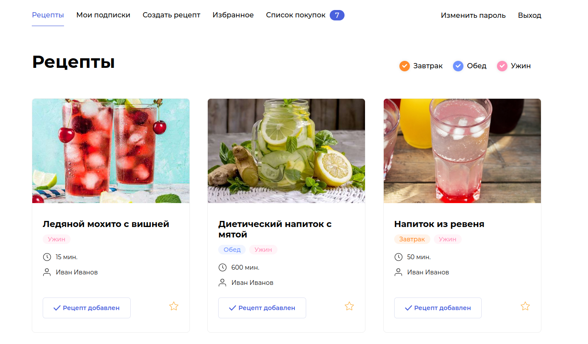

## **Сайт Foodgram, «Продуктовый помощник».**

- Адрес - https://foodgram-project.ddns.net/ (или http://158.160.64.235:7000/)
- Логин (почта) - tarasov.itc@yandex.ru
- Пароль - 1234509876t

### Онлайн-сервис и API. 

На этом сервисе пользователи смогут 
публиковать рецепты, подписываться на публикации других пользователей, 
добавлять понравившиеся рецепты в список «Избранное», а перед походом в 
магазин скачивать сводный список продуктов, необходимых для приготовления 
одного или нескольких выбранных блюд.



#### Технологи:

- Python 3.9
- Django 3.2.3
- Django Rest Framework 3.12.4
- Djoser 2.2.0
- Gunicorn 20.1.0

#### Серверная инфраструктура:
- Docker
- PostgreSQL
- Nginx
- GitHub Actions
- Linux Ubuntu с публичным IP

### Предварительные настройки и запуск:

- Подразумевается что Docker уже установлен
- Клонировать репозиторий: `git@github.com:trsv-dev/foodgram-project-react.git`
- Перейти в папку проекта: `cd foodgram-project-react`, далее - `cd backend`
- Установить виртуальное окружение: `python3 -m venv venv` и активировать его `source venv/bin/activate`
- Установить зависимости из файла requirements.txt: `pip install -r requirements.txt`
- Выполнить миграции: `python manage.py migrate`
- Создать суперпользователя: `python manage.py createsuperuser`
- В корневой директории проекта создать файл .env
```
#Django settings:
DEBUG=False
SECRET_KEY=your_django_superduper_strong_secret_key
ALLOWED_HOSTS=127.0.0.1, localhost

#PostgreSQL settings:
POSTGRES_DB=foodgram_database
POSTGRES_USER=foodgram_user
POSTGRES_PASSWORD=postgres_pass
DB_NAME=foodgram
DB_HOST=db
DB_PORT=5432

#Nginx settings:
NGINX_PORT=80

#DockerHub settings:
# Если планируется дальнейшая разработка:
DOCKERHUB_LOGIN=your_dockerhub_login
```

### Билдим образы:
Замените 'username' на ваш логин на Docker Hub.
```
cd infra  # В директории infra...
docker compose -f docker-compose.yml up -d # запускаем сборку
docker compose -f docker-compose.yml exec backend python manage.py migrate # делаем миграции
docker compose -f docker-compose.yml exec backend python manage.py load_csv # загружаем тестовые данные
docker compose -f docker-compose.yml exec backend python manage.py createsuperuser # создаем суперпользователя
docker compose -f docker-compose.yml exec backend python manage.py collectstatic # собираем статику
docker compose -f docker-compose.yml exec backend cp -r /app/collected_static/. /app/static/ # раскладываем статику по местам
```
Проверьте, что на вашем компьютере созданы необходимые образы, 
— выполните команду `docker image ls`.

Проверяем работу. Заходим на http://127.0.0.1:80